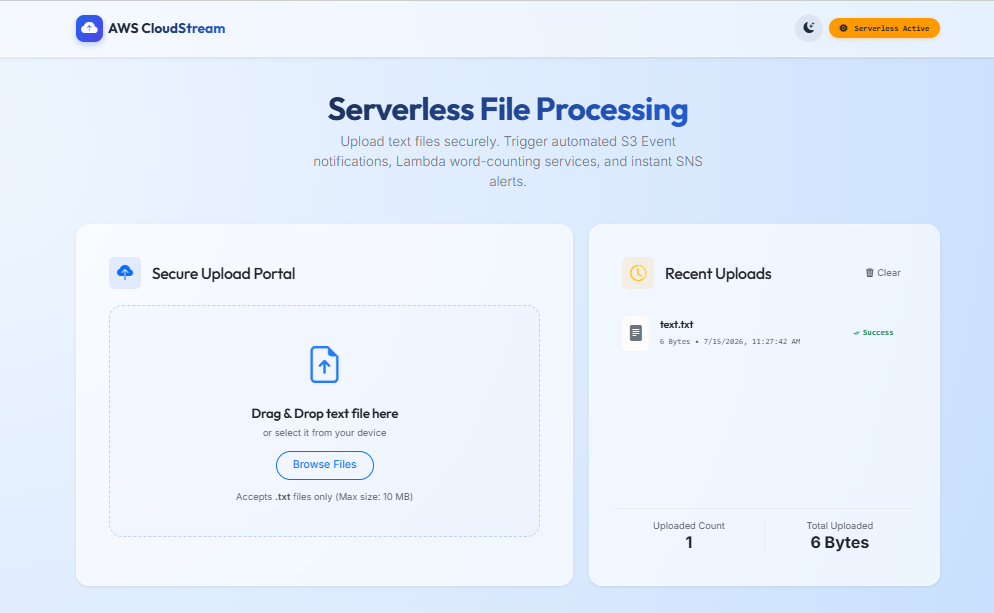
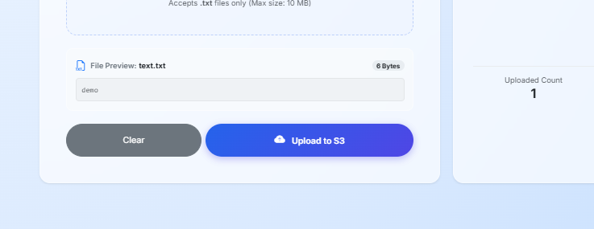
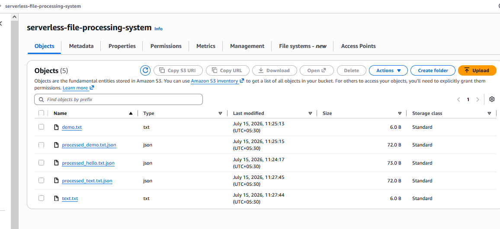
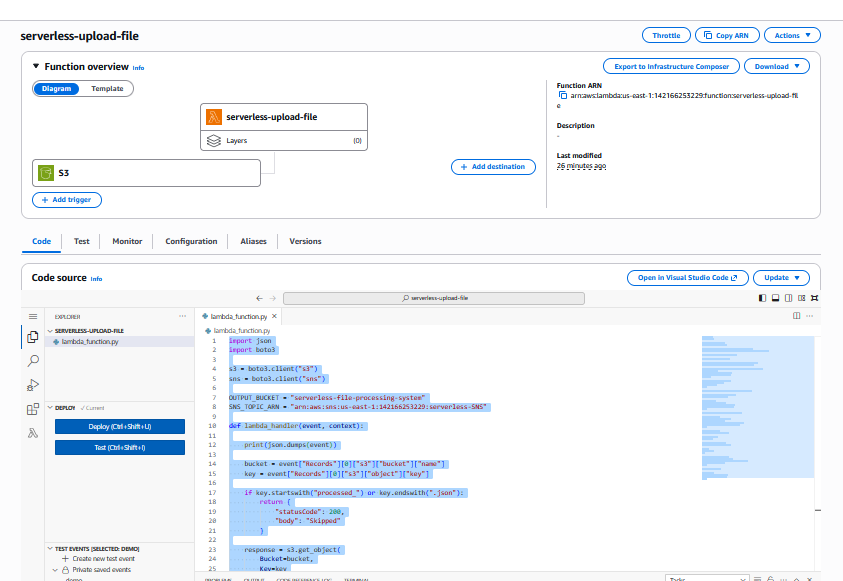
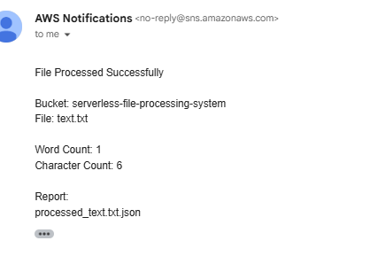

# ☁️ Serverless File Processing System

<p align="center">
  
  
  
  
  
  
</p>


---
## 📖 Project Overview

The **Serverless File Processing System** is a complete, production-ready Serverless File Upload & Processing application. It features a robust **FastAPI** backend in Python, a modern, highly aesthetic web client interface built with **HTML5, CSS3, and JavaScript (Bootstrap 5)**, and integrated AWS serverless infrastructure (**Amazon S3**, **AWS Lambda**, and **Amazon SNS**).

The system follows a fully decoupled, reactive event-driven model:

```
+--------------------------------------------------------------------------------+
|                                    BROWSER                                     |
|  +------------------+                   +-----------------------------------+  |
|  |   HTML5 Canvas   |  <=============>  | JavaScript (Vanilla, Local Hist)  |  |
|  +------------------+                   +-----------------------------------+  |
+--------------------------------------------------------------------------------+
                                           │
                                           │ HTTP POST (multipart/form-data)
                                           ▼
+--------------------------------------------------------------------------------+
|                                FASTAPI BACKEND                                 |
|  +-------------------+                  +-----------------------------------+  |
|  |   app.py (CORS)   |  ------------─>  | routes.py (Validators, Endpoints) |  |
|  +-------------------+                  +-----------------------------------+  |
|                                                          │                     |
|                                                          │ boto3 SDK           |
|                                                          ▼                     |
|                                         +-----------------------------------+  |
|                                         |  s3_service.py (Object Upload)    |  |
|                                         +-----------------------------------+  |
+--------------------------------------------------------------------------------+
                                                           │
                                                           │ HTTPS (s3.upload_fileobj)
                                                           ▼
+--------------------------------------------------------------------------------+
|                             AWS CLOUD SERVICES                                 |
|  +--------------------+                                                        |
|  |     Amazon S3      | (Input Bucket)                                         |
|  +--------------------+                                                        |
|            │                                                                   |
|            │ Object Created Event Trigger                                      |
|            ▼                                                                   |
|  +--------------------+                                                        |
|  |     AWS Lambda     | (Processes Text: e.g., counts words, averages)         |
|  +--------------------+                                                        |
|       /            \                                                           |
|      /              \ Stores processed output                                  |
|     /                ▼                                                         |
|    /         +--------------------+                                            |
|   /          |     Amazon S3      | (Output Bucket)                            |
|  /           +--------------------+                                            |
| ▼                                                                              |
|  +--------------------+                                                        |
|  |     Amazon SNS     | =====> Sends Email Notification                        |
|  +--------------------+                                                        |
+--------------------------------------------------------------------------------+
```

---

## ✨ Key Features

### 🎨 Frontend Features
- **Aesthetic Cloud Dashboard**: Modern custom layout with rich blue radial gradients, CSS transitions, and glassmorphism styling.
- **Dark Mode Support**: Seamless dynamic dark/light mode toggle with state persistence in `localStorage`.
- **Drag & Drop Upload**: Interactive drag-over zones that light up and accept file payloads.
- **Client-Side Validations**: Enforces `.txt` extension limit and `< 10 MB` size threshold instantly before sending to the backend.
- **Real-Time Preview**: Displays text file content within an interactive scroll panel prior to upload.
- **Upload Progress Tracker**: Uses `XMLHttpRequest` progress metrics to drive a Bootstrap progress bar and percentage display.
- **Recent Uploads History**: A client-side log (stored in `localStorage`) displaying the status, size, and timestamp of recent attempts.
- **Interactive Toasts**: Clean toast alerts that announce results in color-coded overlays.

### ⚙️ Backend Features
- **FastAPI Engine**: Asynchronous architecture providing rapid processing and automatic Swagger documentation.
- **Robust S3 Integration**: Native `boto3` streams upload file buffers straight into S3 without loading them into server memory unnecessarily.
- **AWS Exception Parser**: Automatically intercepts boto3 runtime exceptions (like missing IAM keys, bad bucket configurations, network outages) and converts them into structured HTTP responses.
- **Unified Logging**: Outputs application telemetry (such as initialization details, upload start, size checkpoints, completions, and exceptions) cleanly using standard python logging.
- **CORS Enabled**: Out-of-the-box configuration allowing cross-origin requests from the static HTML frontend.

---

## 🛠️ Technology Stack

| Category | Technology | Description |
| :--- | :--- | :--- |
| **Frontend** | HTML5, CSS3, JavaScript, Bootstrap 5 | Responsive Web Dashboard, UI Theme Persistence, File Upload UI |
| **Backend** | FastAPI (Python 3.12) | Asynchronous API Framework, Validation, and Routing |
| **Cloud Storage** | Amazon S3 | Secure Bucket Storage for Input & Processed Output |
| **Compute** | AWS Lambda | Event-driven processing function executing Python 3.12 |
| **Notifications**| Amazon SNS | Real-time Email notifications on successful processing |
| **SDK & Utils**  | boto3, python-dotenv, uvicorn | AWS SDK integration, environment configuration, ASGI server |

---

## 📂 Folder Structure

```text
Serverless File Processing System/
│
├── backend/
│   ├── app.py              # Application entrypoint & CORS config
│   ├── config.py           # Configuration loader (.env parser)
│   ├── routes.py           # API endpoints (GET / and POST /upload)
│   ├── s3_service.py       # Amazon S3 upload implementation (boto3)
│   ├── utils.py            # Validation helpers & response builders
│   ├── requirements.txt    # Python dependencies
│   ├── .env                # Local AWS Credentials (secrets)
│   └── README.md           # Backend specific readme
│
├── docs/
│   ├── index.html          # Dashboard HTML structure
│   ├── style.css           # Layouts, themes, animations, & variables
│   └── script.js           # Client actions, requests, & theme toggle
│
├── lambda/
│   └── lambda_function.py  # AWS Lambda text processing function code
│
├── screenshots/            # UI presentation captures
│   ├── home.png
│   ├── upload.png
│   ├── s3.png
│   ├── lambda.png
│   └── email.png
│
└── README.md               # Main project readme
```

---

## ⚙️ Installation & Setup

### 1. Backend Setup (FastAPI)

#### Create a Virtual Environment
Navigate to the project root and create a virtual environment in the `backend` folder:
```bash
# Enter backend folder
cd backend

# Create virtual environment
python -m venv venv

# Activate the virtual environment
# Windows (PowerShell):
.\venv\Scripts\Activate.ps1
# Windows (Command Prompt):
.\venv\Scripts\activate.bat
# macOS/Linux:
source venv/bin/activate
```

#### Install Dependencies
```bash
pip install -r requirements.txt
```

#### Configure Environment Variables
Create a file named `.env` in the `backend/` directory and populate it:
```env
AWS_ACCESS_KEY_ID=your_access_key_id
AWS_SECRET_ACCESS_KEY=your_secret_access_key
AWS_REGION=your_region
S3_BUCKET_NAME=your_bucket_name
```

#### Running the Backend
Start the server using `uvicorn`:
```bash
uvicorn app:app --reload --host 127.0.0.1 --port 8000
```
- The API health check will be active at `http://127.0.0.1:8000/`.
- Swagger interactive documentation is generated at `http://127.0.0.1:8000/docs`.

---

### 2. Frontend Setup

Since the frontend is built using standard Vanilla JavaScript, HTML5, and CSS3, it does not require a compilation step.

#### Running the Frontend
You can open `docs/index.html` in your web browser:
- **Option A (Simple)**: Double-click the `docs/index.html` file to open it directly (`file://` protocol).
- **Option B (Recommended)**: Serve the files using a local HTTP server:
  ```bash
  # Using Python (from the docs directory):
  cd docs
  python -m http.server 5500
  ```
  Open `http://127.0.0.1:5500` in your browser.


---

## ☁️ AWS Configuration & Deployment (Reference)

To complete the serverless loop on AWS:

### 1. Amazon S3 Input Bucket
- Create the bucket configured in your `.env` (e.g. `serverless-file-processing-system`).
- Block public access and assign appropriate IAM policies to the user access keys.

### 2. AWS Lambda Setup
- Create a Lambda function using the **Python 3.12** runtime.
- Attach policies allowing Lambda to read from your input bucket, write to your output bucket, and publish to SNS.
- Sample Lambda Handler code (`lambda/lambda_function.py`):
  ```python
  import json
  import boto3
  s3 = boto3.client("s3")
  sns = boto3.client("sns")

  OUTPUT_BUCKET = "serverless-file-processing-system"
  SNS_TOPIC_ARN = "arn:aws:sns:us-east-1:142166253229:serverless-SNS"

  def lambda_handler(event, context):
      print(json.dumps(event))

      bucket = event["Records"][0]["s3"]["bucket"]["name"]
      key = event["Records"][0]["s3"]["object"]["key"]

      # Prevent recursive processing loop
      if key.startswith("processed_") or key.endswith(".json"):
          return {
              "statusCode": 200,
              "body": "Skipped"
          }

      response = s3.get_object(
          Bucket=bucket,
          Key=key
      )

      text = response["Body"].read().decode("utf-8")

      word_count = len(text.split())
      char_count = len(text)

      report = {
          "filename": key,
          "word_count": word_count,
          "char_count": char_count
      }

      output_key = f"processed_{key}.json"

      s3.put_object(
          Bucket=OUTPUT_BUCKET,
          Key=output_key,
          Body=json.dumps(report, indent=4),
          ContentType="application/json"
      )

      message = f"""
  File Processed Successfully

  Bucket: {bucket}
  File: {key}

  Word Count: {word_count}
  Character Count: {char_count}

  Report:
  {output_key}
  """

      response = sns.publish(
          TopicArn=SNS_TOPIC_ARN,
          Subject="File Processed Successfully",
          Message=message
      )

      print(response)

      return {
          "statusCode": 200,
          "body": "Success"
      }
  ```

### 3. S3 Event Notification
- Go to your input S3 bucket -> Properties -> Event notifications.
- Create a notification for `All object create events` and route it to your Lambda function.

### 4. Amazon SNS Configuration
- Create an SNS Topic (Standard) named `serverless-SNS`.
- Create an Email subscription for your topic and confirm the subscription request from your email inbox.

---

## 🔐 IAM Policy Example

For secure, least-privilege AWS integration, attach a policy similar to the following to your IAM User/Execution Role:

```json
{
  "Version": "2012-10-17",
  "Statement": [
    {
      "Effect": "Allow",
      "Action": [
        "s3:GetObject",
        "s3:PutObject",
        "s3:ListBucket"
      ],
      "Resource": [
        "arn:aws:s3:::serverless-file-processing-system",
        "arn:aws:s3:::serverless-file-processing-system/*"
      ]
    },
    {
      "Effect": "Allow",
      "Action": [
        "sns:Publish"
      ],
      "Resource": "arn:aws:sns:*:*:serverless-SNS"
    },
    {
      "Effect": "Allow",
      "Action": [
        "logs:CreateLogGroup",
        "logs:CreateLogStream",
        "logs:PutLogEvents"
      ],
      "Resource": "*"
    }
  ]
}
```

---

## 📊 API Specification

### Endpoint: `POST /upload`
Uploads a text file to the configured Amazon S3 input bucket.

- **Request Content Type**: `multipart/form-data`
- **Body parameters**:
  - `file`: The text file payload (validated backend-side to ensure `.txt` extension and size < 10MB)

- **Success Response (200 OK)**:
  ```json
  {
      "message": "File uploaded successfully"
  }
  ```

- **Example Error Responses**:
  - **400 Bad Request** (Invalid file format):
    ```json
    {
        "detail": "Only .txt files are allowed."
    }
    ```
  - **500 Internal Server Error** (AWS credentials missing):
    ```json
    {
        "detail": "AWS credentials not found. S3 client authentication failed."
    }
    ```

---

## 📸 Screenshots

### Home Page


---

### Upload Progress


---

### Amazon S3 Bucket Console


---

### AWS Lambda Function


---

### SNS Email Notification


---

## ✅ Verification & Testing

1. **Verify Backend Status**:
   - Access `http://127.0.0.1:8000/`. It should display a running message or access the Swagger API docs at `http://127.0.0.1:8000/docs`.
2. **Testing File Upload Restrictions**:
   - Attempt uploading a `.png` or `.pdf` file. The frontend drop-zone displays a validation error instantly.
   - Attempt uploading a text file exceeding `10 MB`. The frontend rejects it client-side.
3. **AWS Error Handlers**:
   - Run the server with empty/invalid `.env` credentials. Upload will gracefully fail with a descriptive message: `AWS credentials not found. S3 client authentication failed.`
   - Run the system with a non-existent bucket configuration. Upload will fail with: `The configured S3 bucket does not exist. Check S3_BUCKET_NAME config.`
4. **Successful Pipeline Run**:
   - Upload a valid `.txt` file.
   - The UI shows real-time upload progress, transitions to a success notification, and appends a record in the local history.
   - S3 Input bucket registers the original `.txt` file.
   - S3 Event notification triggers the Lambda function.
   - Lambda processes the file, saves a matching `processed_[filename].json` report containing metrics (word/character counts) back into the S3 bucket, and sends an email status update using SNS.

---

## 🚀 Future Enhancements
- **Multipart Chunking**: Enable chunked uploads for files exceeding 100MB to S3 directly via pre-signed URLs.
- **DynamoDB Telemetry**: Store upload audit logging and execution results in DynamoDB database tables.
- **Cognito Integration**: Secure the portal with Amazon Cognito User Pools for user sign-in and authorization.
- **Real-Time WebSockets**: Use WebSockets in FastAPI to stream Lambda execution progress directly back to the user interface.
- **OCR Integration**: Extract textual context from PDFs or images using Amazon Textract.

---

## 👨‍💻 Author

**Vishal Lavare**  
*Cloud & DevOps Engineer*

- AWS Cloud & Serverless Architectures
- Containerization & Orchestration (Docker, Kubernetes)
- CI/CD Pipelines (GitHub Actions, GitLab CI)
- Backend Development (FastAPI, Python)

---

### ⭐ If you found this project useful, don't forget to Star this repository!
